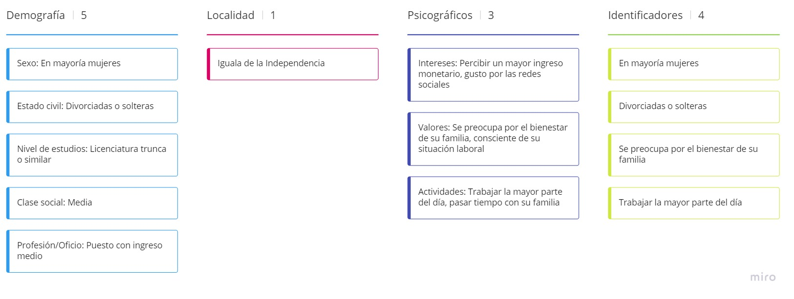

## Público Objetivo

Mi diseño del público objetivo se basó en la población de mi ciudad, donde habitan poco menos de 200,000 personas. Como señalo en el diagrama, se enfoca en jovenes adultos, mayormente mujeres que se hayan divorciado o que vivieran con su conyuge y quese haya dado a luz a un bebé.

El fundamento principal es sobre las demandas de manutención ya que, desgraciadamente, los padres son los que dejan la familia. Además, la ley dice que a pesar de que una pareja no se haya casado pero al haber tenido un hijo, el padre o madre demandado, debe de garantizar el bienestar del hijo, en este caso dando una pensión alimenticia para los gastos básicos.

Abogabot, estaría enfocado en esa parte de la población, ya que al ser jovenes adultos, tienen más contacto con las tecnologías y no sería tan complicado el entender el modelo de negocio.

