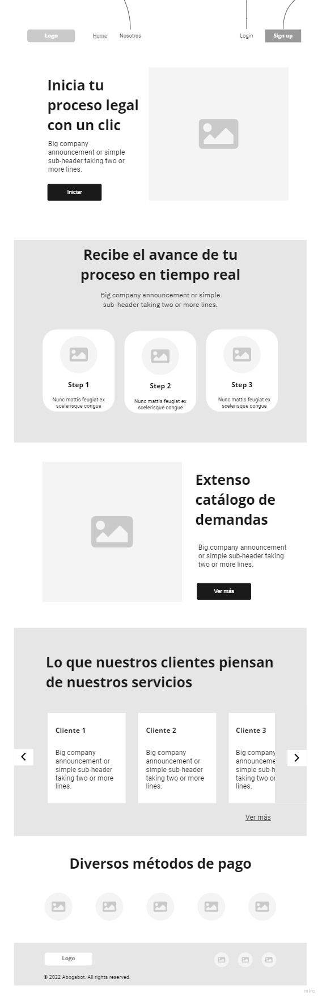
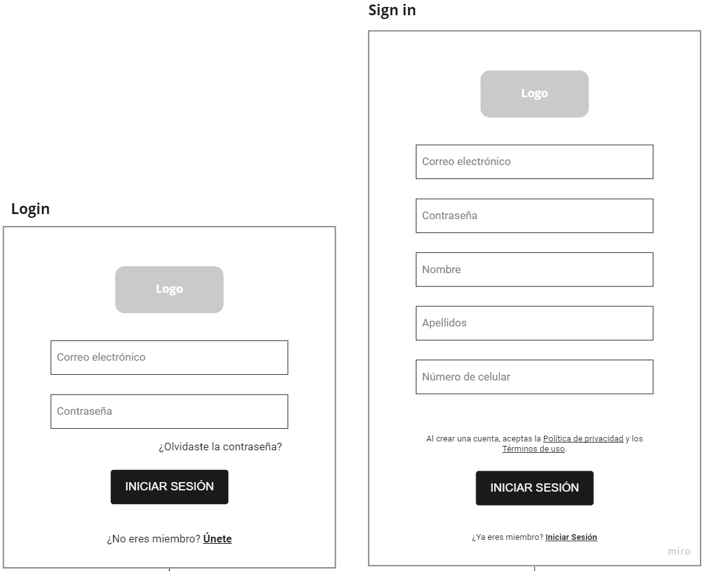
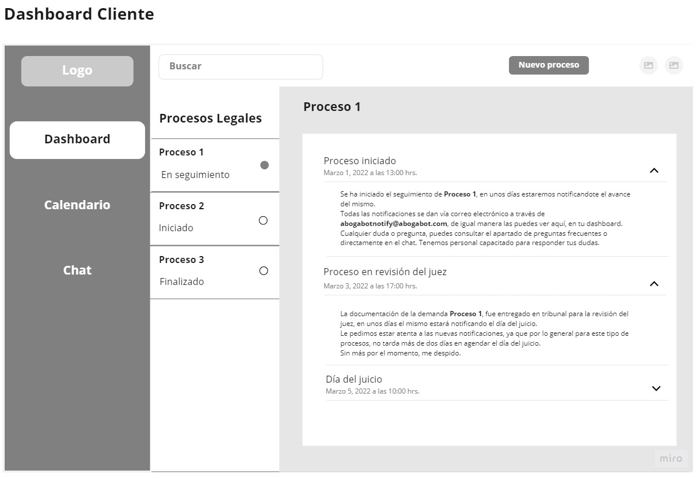
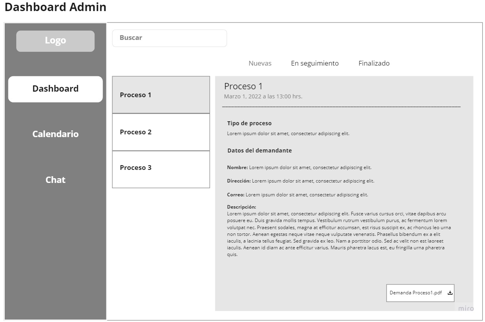
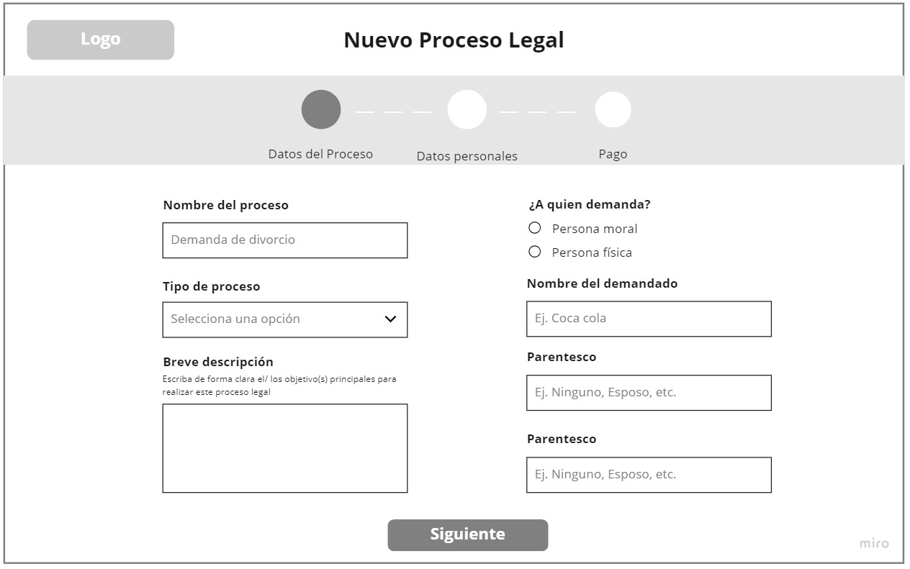
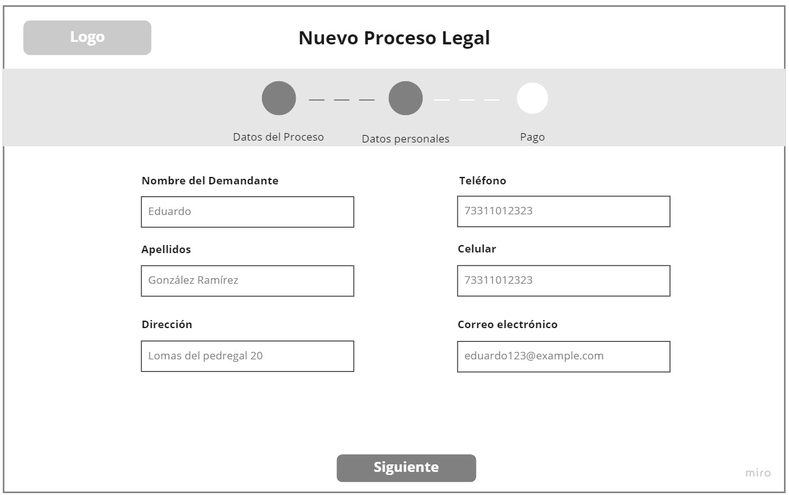
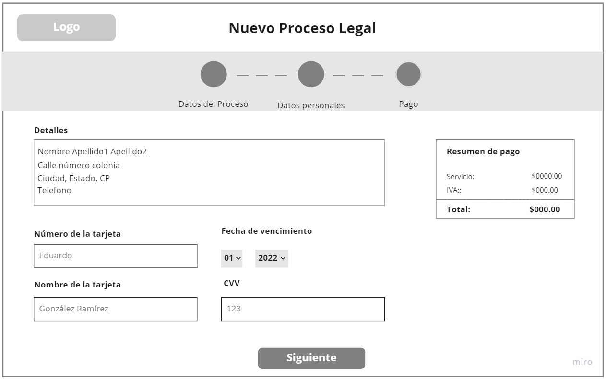

## Wireframe

Diseño UX del concepto de Abogabot

### Página principal (Home)

Se muestra la información relevante para el cliente, con una estructura amigable, haciendo un balance texto con imagenes.

### Concepto de login y sign in

Se muestran dos ventanas emergentes al dar clic al botón correspondiente, los cuales contienen un form solicitando información del usuario.

### Dashboard

Este dashboard es por parte del cliente, donde puede observar sus demandas realizadas, saber su estatus y las diferentes notificaciones con la información de los avances.

Por su parte, el dashboard del administrador, tiene un parecido al del cliente, solamente que aqui se puede observar información del cliente, una breve descripción con las propias palabra de este, explicando cual es el motivo de la demanda.

## Proceso de pago

Este concepto se realizó con varios pasos, pidiendo al usuario diferentes datos tanto personales como de la demanda en si, además, en la parte final se tiene el apartado del método de pago, donde se valida la solicitud del usuario.

